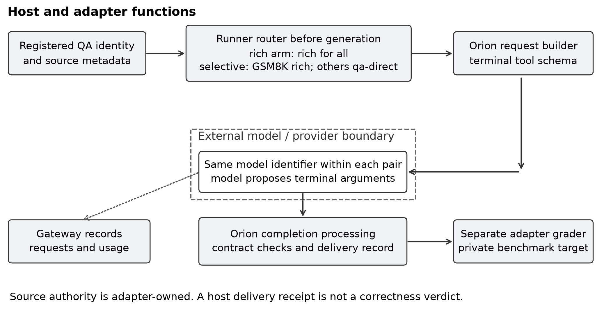

# Source Conditioned Completion Contracts in an LLM Agent Harness

Petr A. Piatkov

Independent researcher, Ufa, Russian Federation

Corresponding author: bigbox89@mail.ru

ORCID: 0009-0003-0423-6467

## Abstract

**Context:** Tool-calling agents often use a single evidence-rich completion contract for tasks with different reporting needs. This can impose unnecessary protocol work on factual question answering. **Objective:** Evaluate whether a trusted source label can select a smaller terminal contract while retaining host-side answer evaluation. **Methods:** A frozen campaign using Orion, an author-developed agent harness, compared rich and source-conditioned contracts on the same 600 task identities across four provider model identifiers, producing 2,400 model-task pairs and 4,800 assigned trial windows. Each family contributed 200 tasks. The primary outcome was the ratio of total logical prompt and completion tokens. Prespecified gates required more than 15% saving, less than five percentage points of quality loss, and zero integrity failures, using task and source-cluster bootstraps with four-model multiplicity adjustment. **Results:** Qwen and DeepSeek satisfied their individual gates, saving 25.76% and 21.34%. Their source-cluster lower saving bounds were 22.39% and 18.29%. GLM and GPT-OSS showed descriptive savings but failed the zero-integrity condition. **Conclusions:** Completion-contract routing reduced measured token expenditure for two model deployments in a restricted QA setting. The evidence concerns this harness configuration and source-labelled task mixture. It does not establish repository-task improvements, autonomy, adversarial robustness, monetary savings, or a universal advantage of smaller schemas. Reanalysis of original traces reproduces the frozen results and verifies the expected route in all 6,441 forwarded requests. Additional trace measurements describe token components, latency, and validation behavior.

**Keywords:** agent harness; completion contract; source-conditioned routing; empirical evaluation; token efficiency; reproducibility

## 1 Introduction

An agent harness is executable software around a language model. It selects tools, builds requests, checks proposed actions, records observations, and decides when an episode has ended. These choices determine part of the work that a model must perform. A model answering a multiple-choice question may be asked to emit an answer, a summary, acceptance criteria, evidence references, and other control fields before the harness accepts completion. The extra obligations can affect the request schema, generated arguments, subsequent feedback, and repeated completion attempts. Measuring the entire episode is therefore necessary when evaluating a change to a terminal interface.

This paper studies source-conditioned completion-contract routing in Orion, an author-developed command-line harness for language-model agents. Orion is the experimental software implementation used here; prior familiarity with it is not assumed. Its full source code is not publicly available. The research package provides the exact executable used in the evaluated campaign, the experiment runner, and primary records. A source identifier supplied by a registered task adapter selects between an evidence-rich `task_complete` contract and a factual-QA contract containing `status` and `response`. The router executes before generation. It does not infer a route from an answer, a correctness score, or a model-generated claim about its source. The underlying agent and provider model identifier remain the same within each paired comparison. The terminal interface and the harness processing associated with that interface change.

The engineering question is whether a narrow task adapter can reduce the model's reporting obligations without moving correctness decisions into the model. For the evaluated QA tasks, the benchmark grader already owns correctness. A host receipt can establish that the harness received a response; it cannot establish that the response is true. Keeping these responsibilities separate makes a smaller terminal contract plausible. The empirical question is whether the resulting episode actually uses fewer tokens while preserving the specified accepted-answer outcome.

I evaluate this mechanism through the completed F10 v5 campaign, preserving its original protocol, analysis code, and recorded outcomes. It comprises four model lanes on the same 600 task identities. Two lanes meet the individual confirmatory conditions. All four are reported, including the two lanes that do not meet the integrity requirement. This revision adds an audit of every original execution record and descriptive measurements of token components, retries, latency, and validation behavior. These additions are explicitly distinguished from the campaign's prespecified tests. The primary question is whether the registered contract policy reduces episode-level token expenditure while satisfying accepted-answer and integrity conditions. The additional engineering questions concern consistent route exposure and the interaction paths accompanying the policy effect.

### 1.1 Related work and the contribution

ReAct interleaves model reasoning with actions and observations, showing why the interaction loop deserves evaluation beyond a single answer (Yao et al. 2023). Toolformer studies learning to invoke external APIs and incorporate their results (Schick et al. 2023). These contributions concern action selection and tool use. The present intervention concerns the interface through which an existing loop declares a terminal outcome. It neither trains a new tool policy nor changes model weights.

SWE-agent treats agent-computer interfaces as a design variable and studies how interfaces support repository navigation, editing, and testing (Yang et al. 2024). Agentless investigates a simpler localization, repair, and validation workflow for software tasks (Xia et al. 2024). Together they motivate assessing the cost and behavior of the surrounding software. Orion's terminal contract is another interface variable, but this study uses QA tasks to isolate it. The repository-level evidence in those papers does not transfer to the QA results here, and the QA results do not transfer automatically to repository editing.

Kapoor et al. (2024) argue for evaluating agent cost alongside accuracy, using meaningful holdouts and reproducible evaluation procedures. This study implements a joint decision: lower episode-level token expenditure is insufficient if the quality or integrity conditions fail. It also preserves failures in the assigned sample. The two model lanes that pass are an outcome of the original four-model analysis, rather than a retrospectively defined two-model experiment.

Structured-output research addresses whether a model or decoding framework can generate objects satisfying a supplied schema. JSONSchemaBench evaluates structured-output efficiency, coverage, and quality (Geng et al. 2025). Schema validity and semantic correctness are distinct questions. Our design also distinguishes them, but asks an upstream question: which completion schema should a trusted adapter require for a given source family? No grammar-constrained decoding engine is introduced or compared. Differences between rich and QA contracts can change both generation and harness feedback, so the estimand is the total contract-policy effect, not a pure decoding effect.

Recent work also directly tests the assumption that imposing an output structure leaves substantive accuracy unchanged. Ray (2026) studies validity-correctness tradeoffs for small language models at fixed model and problem instances. This is adjacent to our quality guardrail, but changes decoding constraints rather than selecting a terminal contract using registered source metadata. It further limits any claim that schema-related quality effects are themselves new.

The contribution is a concrete contract-routing implementation with explicit responsibilities, a paired four-model evaluation with cost, quality, and integrity gates, and an artifact audit linking the frozen outcomes to primary execution records and reproducible analysis. I do not claim to introduce source routing, JSON schemas, or host-side validation in general. The distinctive empirical comparison holds the agent configuration and model identifier fixed within a pair while changing the terminal-contract policy using adapter-owned source metadata.

## 2 Methods

### 2.1 Harness architecture and the routing boundary

Orion is implemented in Go and runs as a local command-line process around a remote language-model deployment. The evaluated executable targets Linux amd64 and was used on Ubuntu. It is not a language model or a new decoding algorithm. It implements the model interaction loop, advertises callable tools, interprets their proposed arguments, applies completion checks, and writes session and outcome records. The study uses only the QA-relevant configuration of this larger system. Other functionality is outside the empirical scope, and distributing an executable does not make the full harness open source.

Each trial starts a new Orion process with separate workspace and home directories. The runner materializes the task, supplies the prompt on standard input, writes configuration, and passes the selected model identifier and loopback gateway URL. Source routing has already chosen the terminal contract at that point. The tool schema and accumulated messages enter the provider request. A returned native terminal call enters Orion completion processing; negative tool results can become feedback for a subsequent request. Some episodes end through a direct-text terminal path, so tool-result events and provider requests are not interchangeable counts. The controller records the resulting completion state and response in the session. The runner then extracts that response and performs external grading. This sequence separates a model-proposed answer, host acceptance of completion, and correctness against a benchmark target.

The gateway is a separate experiment component. It owns the external provider credential, while Orion receives only a loopback placeholder credential. It records the Orion request, forwarded payload, saved response JSON, usage receipt, and original upstream status. Requests are serial within each model lane. The runner separately records executable/configuration bindings, initial workspace hashes, process exit state, elapsed time, and the final per-trial result. The five-attempt provider policy includes the initial attempt; it does not mean five additional retries. The outer task deadline is enforced by the runner. These responsibilities are documented from recovered runner code and execution records, rather than inferred from the Orion name.

The evaluated implementation has five relevant components. A dataset adapter materializes a prompt and task identity. The experiment runner selects an arm and contract, writes configuration, and launches Orion. Orion constructs the tool-calling request and processes the terminal call. A loopback gateway forwards requests to the provider and writes transport records. An adapter-side grader checks the final answer against separately stored targets. The gateway normalizes local workspace and home paths for paired context comparison; the recovered runner records that responses and evidence identifiers are not rewritten.

The source router is in the experiment runner, before the Orion process is invoked. Specifically, the recovered `screen.py` checks that the materialized case has QA kind and a registered task-ID prefix. It chooses rich for `gsm8k_` identities and QA-direct for `mmlu_` and `squad2_` identities in the selective arm. Thus the abstract source label is concretely represented by adapter-owned task registration and its prefix. This experiment does not demonstrate an independently authenticated source-label service or a general-purpose router deployed for arbitrary user prompts.

The rich arm uses the rich contract for every family. The selective arm uses the frozen mapping in Table 1. Both arms use the general agent, direct response mode, no skills, no model memory, non-streaming requests, and disabled thinking in the recorded provider configuration. The QA tool surface is restricted to `task_complete`; shell execution is disabled. Stable prompt-prefix and tool-ABI settings are retained. The terminal-attempt cap is three in the recovered runner. The intervention therefore applies to a constrained terminal tool use setting rather than a broad collection of agent tools.

**Table 1 Source allocation and frozen terminal routing**

| Family | Unique tasks | Rich arm | Selective arm | Target check |
| --- | --- | --- | --- | --- |
| GSM8K | 200 | rich | rich | Final numeric answer |
| MMLU | 200 | rich | qa-direct | Option letter |
| SQuAD2 subset | 200 | rich | qa-direct | Normalized exact match |

The trust boundary in Figure 1 describes allocation of authority. Source registration, routing, receipt creation, and grading are host functions. The prompt and model's arguments are data to be evaluated. A caller must keep source registration outside model-controlled text for this policy to retain that interpretation. Neither the diagram nor this non-adversarial campaign proves that all possible attacks cannot cross the boundary.



Figure 1 Architecture and allocation of authority. This diagram documents the design; it is not evidence of adversarial safety. Original runtime records verify both terminal contracts and their recorded processing; the diagram does not attest provider internals.

### 2.2 Completion contracts and host-generated records

The QA-direct model-facing object has two required fields: `status`, with the alternatives `completed`, `partial`, and `blocked`, and `response`, a string. For an ordinary completed answer, the wire payload has the form shown in Listing 1. The answer string is the value graded by the task adapter. In this contract, completed means that a response was delivered; it is not an external correctness assertion.

```json
{"status":"completed","response":"B"}
```

**Listing 1.** QA-direct terminal payload for a multiple-choice answer. The value is illustrative and is not an answer from the confirmation sample.

The rich interface asks the model for additional control-plane information. Its direct-response form includes status, summary, response, criteria, and evidence references. Criteria identify a requested condition, its met or unmet state, explanatory evidence, and receipt references. Other declared properties can describe blockers, remaining actions, changed files, verification, and artifacts. Listing 2 illustrates the structural difference without inventing an evidence identifier. Empty arrays do not assert evidence that is absent.

```json
{
  "status":"completed",
  "summary":"The requested answer was delivered",
  "response":"B",
  "criteria":[{
    "title":"Answer delivered",
    "state":"met",
    "evidence":"The response contains the answer",
    "evidence_refs":[]
  }],
  "evidence_refs":[]
}
```

**Listing 2.** Illustrative rich direct-response payload. It explains the reporting obligations, not whether this particular call would pass every runtime validator.

For QA-direct processing, the inspected Orion implementation constructs the control summary, delivery criterion, and receipt on the host side while retaining the response payload. A delivery receipt is evidence of reception. It does not replace the benchmark target or certify factual truth. Rich evidence references likewise require host interpretation; model-generated prose is not intrinsically a trusted receipt. Contract validation occurs in Orion's completion processing. Benchmark correctness is evaluated separately by the adapter after the episode.

Appendix B provides exact JSON objects for the documented reference interfaces and their provenance. The original executable, runner, request schemas, and session records have been recovered. The supplementary audit verifies byte bindings and inventories the complete schema objects in every forwarded request. The two observed objects also equal the separately inspected source-reference objects. The primary analyzer's coarse route classification depends only on the `task_complete` property set, as explained below; the all-request audit is a separate descriptive verification.

### 2.3 Task population and selection

The campaign contains 600 unique task identities shared across four model lanes: 200 GSM8K arithmetic word problems, 200 MMLU multiple-choice items, and 200 SQuAD2 reading-comprehension items. There are 600 paired comparisons within each lane, 2,400 model-task pairs across lanes, and 4,800 assigned arm windows. Reusing the same identity across models does not create another independent task. The target population for the numerical estimate is the frozen, equally allocated three-family mixture under the tested adapter rules.

GSM8K provides arithmetic tasks with numeric targets (Cobbe et al. 2021). The adapter requests only the final number and compares its parsed final numeric answer with the target. MMLU spans subject areas (Hendrycks et al. 2021); selection allocated 50 identities to each of four subject groups. The realized manifest contains 51 subject clusters. The adapter requests a single option letter and checks the recognized answer against the target choice.

SQuAD2 includes both answerable and unanswerable questions (Rajpurkar et al. 2018), but this campaign uses only an answerable consensus subset. The freezer excludes `is_impossible` items, requires at least two non-empty reference annotations, and retains only cases with one normalized reference answer. The grader checks normalized exact match, rather than reporting the official full-dataset EM/F1 evaluation. The realized sample spans 33 article clusters. No result is claimed for abstention on unanswerable SQuAD2 questions.

Tasks were ranked by hashes built from the study identifier, source identity, prompt, and target. The source-aware selection procedure applies prior-ID exclusions before taking the required family and MMLU-group allocations. The freeze audit records 2,320 excluded identities. A hash-based arm order counterbalances which arm runs first within each task. The same task order is used across model lanes. Targets are held by the adapter-side grader rather than supplied as answers to the model.

The project includes earlier development and recovery campaigns, including v1-v4 materials. V5 is the final immutable study examined here; the earlier v2 submission archive is superseded. Clean means not used for choosing and tuning this version of the method. It does not establish absence from model training. The v5 protocol retains a stale sentence referring to selection before v2 outcomes; this is not used as proof of v5 chronology. An unmodified protocol flag or stored hash also cannot alone prove the order of events. The recovered excluded-ID file matches its frozen SHA and has no identity overlap with the selected 600 tasks. Qualification used three older identities, with no overlap with this selected sample. These checks verify the retained exclusion rule; they do not independently prove that the history contains every earlier exposure or constitute public preregistration.

### 2.4 Frozen campaign and outcomes

The four provider identifiers are `qwen3.6-fp8-noreason`, `deepseek-v4.1-flash`, `glm-5.3-flash`, and `gpt-oss-120b`, accessed through the same recorded provider endpoint. These identifiers identify deployments used in the campaign; they do not supply an independent attestation of model weights, architecture, or provider-side serving revisions. Paired comparisons use the same identifier. The study is not a controlled comparison of underlying model families.

Each arm has a 900-second task wall deadline. The configured provider-attempt timeout is 880 seconds, the context setting is 131,072 tokens, and the per-step generation limit is 8,192 tokens. V5 fixes the provider-attempt setting at five. This means up to five attempts subject to the outer task deadline, not an additional five retries after an initial attempt. The task deadline can prevent all five attempts from being used. There is no global hard token or request stop cap in the frozen protocol. The planning estimate of 5,400 requests is not a stopping rule.

The primary cost outcome is total logical prompt plus completion tokens across all assigned tasks, including recorded expenditure in unsuccessful and timed-out windows. Let T_R and T_S be the summed rich and selective tokens for a model lane. Saving is (T_R - T_S) / T_R. It is a ratio of totals, not an average of per-task percentage reductions. Token counts include repeated prompts and generations represented in the saved usage accounting. They are not a provider invoice, cache-adjusted expenditure, energy estimate, or latency measurement.

The quality outcome is a correct answer accepted by the harness within the task deadline. A merely plausible answer or a completed terminal status is insufficient. An unaccepted answer, timeout, or other unsuccessful episode contributes failure to this assigned-task outcome. Quality loss is the rich success proportion minus the selective success proportion; a negative value favors selective. The allowed upper bound is below 0.05, or five percentage points. This margin is an engineering tolerance specified in the protocol, not a claim of identical answers or equal per-family quality.

Integrity failure is a separate campaign condition. The recovered runner can mark it for provider failure, incomplete usage accounting, infrastructure errors, or a grader infrastructure-invalid result. The operational hold threshold, max(3, 5% of completed windows), controls whether a lane pauses during collection. Final model-specific confirmation instead requires zero integrity failures. Being below the hold threshold does not satisfy that final condition. An integrity failure also does not mean that the routing mechanism was necessarily ineffective.

The original analyzer verifies model and task bindings, recorded request counts, paired initial-context hashes, and equality of user content in the first requests. Its route exposure check inspects only the first forwarded provider request for each arm. It recognizes QA-direct when `task_complete` declares exactly the property set {status, response}, rich when the property set contains criteria, and unknown otherwise. A mismatch against the arm-family mapping raises an error. This is a first-request schema check. It is not proof of route stability throughout retries, full JSON Schema equality, or validation of every host-generated receipt.

### 2.5 Statistical analysis and estimand

The primary independent unit is a task identity, with one paired contrast per model. The task bootstrap resamples tasks within each family and retains the pair. The source-cluster sensitivity analysis resamples MMLU subject clusters and SQuAD2 article clusters; GSM8K retains task-level resampling. This addresses one form of within-source dependence. It does not make repeated model observations independent, estimate provider-time dependence, or turn the sample into a random population survey.

The frozen analyzer uses 10,000 bootstrap replications, seeds 20260923 and 20260924 for task and cluster resampling, and one-sided alpha 0.0125 per model from a four-model Bonferroni familywise alpha of 0.05. A model passes only when both resampling methods give a saving lower bound above 15% and a quality-loss upper bound below five percentage points, with zero integrity failures. Cost and quality form a joint intersection decision. The numerical comparisons use the frozen implementation's strict inequalities.

In the cluster bootstrap, varying cluster sizes change the realized sampled task counts. The cost metric remains a ratio of sampled token totals. Quality loss is averaged with equal source-family weights. These definitions are reported because a generic statement that both statistics are simply task averages would describe a different estimator. Two-sided 95% intervals, family breakdowns, discordance, and selected-model aggregates are descriptive; they do not replace the original adjusted decision.

The sample size is 600 identities, not 1,200 or 2,400 independent identities. Its adequacy for this narrow decision is judged by the resulting bounds and the prespecified margins. No retrospective power calculation is presented as an a priori design calculation. Family-level results with 200 identities per model illustrate heterogeneity; they are not separately powered confirmatory claims. Passing a quality non-inferiority gate also does not establish a prespecified superiority claim for accuracy.

### 2.6 Additional artifact audit after the campaign

The revised archive retains the original protocol, analyzer, outcomes, frozen manifests, excluded-ID ledger, exact executable, seven SHA-bound runner modules, and primary records. The restored server protocol and outcome file equal the earlier retained local copies byte-for-byte. All 4,800 assigned windows have result, execution, initial-context, and session records; 6,441 forwarded requests have transport receipts. The original archive is retained privately. The submission copy omits ephemeral session signing keys, empty lock files, and Python caches while preserving substantive trace files unchanged. No model is invoked by the reproduction or audit scripts.

The primary-record reproduction reconstructs per-task rows from original result files and applies the unchanged frozen numerical functions. It reproduces totals, outcomes, paired discordance, both bootstrap procedures, and individual decisions. A separate audit checks model, task, and binary bindings; paired first-user content and initial-context hashes; the selected-ID exclusion rule; and the expected contract in every forwarded request. It hashes complete schema objects using sorted compact JSON, compares canonical request hashes with receipts, and reconciles saved response usage with receipt and trial totals. The response hash recorded by the gateway refers to original HTTP body bytes, which were not separately preserved; the audit verifies saved response objects and usage rather than claiming to reproduce that HTTP-body hash.

All supplementary measurements are descriptive analyses after the campaign. Prompt and completion components are summed separately across the assigned windows. Agent wall time is the runner-recorded subprocess duration, including unsuccessful windows; it excludes grading and is not a controlled provider-speed benchmark. Means, medians, and the empirical 95th percentile are reported without new confirmatory tests. Paired mean time differences retain each task contrast.

A transport retry is counted as an identical canonical payload resubmission immediately following a failed provider receipt, without an intervening successful response. Session heartbeat attempt fields remain one during lower-layer retries and are not used as a retry counter. Terminal processing is described through non-relay task_complete result events, repeated terminal-result windows, and negative-result sequences. A recovered sequence requires a negative native terminal result followed by an accepted result and a final accepted completed state. This is an observed interaction path, not a causal estimate of recovery efficacy. Host-generated completion-text relays are counted separately. Executor-validation stalls are identified by the recorded final reason and associated controller traces. None of these definitions changes the frozen primary outcome or decision rule.

### 2.7 Frozen research package and harness availability

The article artifact is distributed separately from the main Orion development repository. Its repository is `https://github.com/pyatkovpetr/emse`, with the research snapshot identified by tag `f10-v5-artifact-r1` and directory `F10-v5`. This repository is private at submission preparation; access requires authorization. The same evidence is supplied in the supplementary replication archive for peer review. No public persistent deposit or open-source release of Orion is claimed. The artifact tag identifies this packaging revision, not the date of protocol registration or an additional outcome campaign.

The snapshot contains the frozen protocol, exact runner and analyzer, task and target manifests, exclusion ledger, dataset snapshots, all four model outcomes, raw transport/session records, exact schema objects, and offline reproduction scripts. The runtime component `orion-linux-amd64-v5` is the original executable with the protocol-bound SHA-256, supplied with embedded build metadata and dependency license notices. It is a Linux ELF executable, not a Windows `.exe`. No replacement executable was built for this packaging step. The base commit and modified-build flag are disclosed; the package does not claim that the full modified source tree can be rebuilt.

Offline reproduction and re-execution are distinct. The former regenerates selection, audits recorded routes and usage, and recomputes the frozen statistics without executing Orion or contacting a provider. The original executable permits inspection and later Linux use, but a new model run would require separately supplied credentials, a reachable compatible service, and a separate versioned run directory. It would not replace the archived outcomes or make already inspected identities a new clean confirmation sample. The packaging revision preserves all substantive primary-file bytes and records their hashes; ephemeral signing secrets and caches are omitted.

## 3 Results

### 3.1 Model-specific confirmation

All four model lanes have 600 task pairs in the retained result file, and the launcher summary reports all four complete. Table 2 reports every lane. Qwen passes its original joint gate with 25.76% token saving and 435 versus 462 correct accepted completions. DeepSeek passes with 21.34% saving and 475 versus 484 successes. Both have zero recorded integrity failures. The narrower of their task and cluster saving lower bounds is still above the 15% practical threshold.

**Table 2 Assigned sample results for every model lane**

| Model | Rich tokens | Selective tokens | Saving | Correct R / S | Integrity failures | Frozen gate |
| --- | --- | --- | --- | --- | --- | --- |
| Qwen | 2,461,995 | 1,827,765 | 25.76% | 435 / 462 | 0 | PASS |
| DeepSeek | 2,119,827 | 1,667,559 | 21.34% | 475 / 484 | 0 | PASS |
| GLM | 2,348,907 | 1,691,306 | 28.00% | 474 / 484 | 2 | Not established |
| GPT-OSS | 3,260,889 | 1,998,642 | 38.71% | 424 / 465 | 1 | Not established |

Table 3 gives the adjusted bounds for the two passing models. DeepSeek's quality upper bounds are close to zero and well below the allowed five percentage points. Qwen's negative upper bounds favor selective. These are bounds for the assigned-task quality difference under the frozen resampling procedures. They do not prove equality on every task, correctness of host receipts, or an accuracy improvement in arbitrary deployment settings.

**Table 3 Adjusted one sided bounds for individually passing models**

| Model | Task saving lower | Cluster saving lower | Task loss upper pp | Cluster loss upper pp |
| --- | --- | --- | --- | --- |
| Qwen | 22.77% | 22.39% | -1.67 | -1.83 |
| DeepSeek | 18.98% | 18.29% | +0.17 | +0.12 |

GLM and GPT-OSS yield descriptive token savings of 28.00% and 38.71%. Both also satisfy the numerical cost and quality bounds in the retained analysis. GLM has two recorded integrity failures and GPT-OSS one. Their final status is therefore confirmation not established. These lanes remain in the report and appendix. They are not silently excluded, treated as negative efficacy results, or repaired in place after their outcomes became visible.

### 3.2 Family results and paired disagreements

Table 4 reports all model-family totals. For Qwen and DeepSeek, the routed MMLU and SQuAD2 families show larger savings than GSM8K. Qwen saves 37.29% on MMLU and 31.31% on SQuAD2; DeepSeek saves 30.00% and 27.28%. GSM8K, which remains rich in both arms, differs by 0.92% and 0.11%. These estimates are descriptive and correspond to different source families with different prompts, answer types, and baseline expenditures.

**Table 4 Descriptive family results for all four models**

| Model | Family | Rich tokens | Selective tokens | Saving | Correct R / S |
| --- | --- | --- | --- | --- | --- |
| Qwen | GSM8K | 624,187 | 618,452 | 0.92% | 170 / 171 |
| Qwen | MMLU | 887,568 | 556,635 | 37.29% | 129 / 152 |
| Qwen | SQuAD2 subset | 950,240 | 652,678 | 31.31% | 136 / 139 |
| DeepSeek | GSM8K | 537,569 | 536,957 | 0.11% | 179 / 180 |
| DeepSeek | MMLU | 735,039 | 514,539 | 30.00% | 158 / 162 |
| DeepSeek | SQuAD2 subset | 847,219 | 616,063 | 27.28% | 138 / 142 |
| GLM | GSM8K | 569,218 | 589,604 | -3.58% | 178 / 180 |
| GLM | MMLU | 851,067 | 467,337 | 45.09% | 160 / 165 |
| GLM | SQuAD2 subset | 928,622 | 634,365 | 31.69% | 136 / 139 |
| GPT-OSS | GSM8K | 798,060 | 781,991 | 2.01% | 170 / 168 |
| GPT-OSS | MMLU | 1,207,166 | 502,827 | 58.35% | 122 / 158 |
| GPT-OSS | SQuAD2 subset | 1,255,663 | 713,824 | 43.15% | 132 / 139 |

The GSM8K comparison supplies a retained same-contract control within the frozen policy. Its near-zero reductions in the two passing lanes are consistent with the routing interpretation. It is not a factorial ablation that independently manipulates schema fields, receipts, validation, and retries. The intervention changes a contract and its processing as a bundle. The evidence cannot assign a percentage of the savings to fewer JSON fields alone.

Qwen has 44 pairs where only selective succeeds and 17 where only rich succeeds. DeepSeek has 16 and seven, respectively. These disagreements show that the gate is evaluated on paired outcomes rather than an assumption that answers never change. The overall quality estimates include all assigned tasks. Family success counts are included in Table 4 so aggregate improvements cannot conceal the direction of a source-specific difference.

For the post-outcome subset of Qwen and DeepSeek, rich spends 4,581,822 tokens and selective 3,495,324. The difference is 1,086,498 tokens, or 23.71%. The subset contains 1,200 model-task pairs on the same 600 identities. This aggregation summarizes two individually passing lanes, but was selected after observing statuses. It is not an additional independent two-model confirmation and does not justify removing the unsuccessful lanes from the four-model report.

### 3.3 Route integrity and component measurements

The audit verifies all 4,800 assigned windows and all 2,400 task pairs against the original analysis. Every forwarded request has the expected contract, including repeated requests and failed provider calls: 4,479 rich and 1,962 QA-direct exposures, with zero mismatches. Exactly two complete schema objects are observed, with no within-window variation. Their sorted compact UTF-8 JSON representations are 2,583 bytes for rich and 364 bytes for QA-direct. These are schema-object byte sizes, not tokenizer counts or a causal decomposition of prompt cost. The task/model bindings, paired initial-context hashes, first-user content, canonical request receipt hashes, and recorded token sums all reconcile.

**Table 5 Additional recorded token components and transport retries**

| Model | Arm | Prompt tokens | Completion tokens | Requests | Retries |
| --- | --- | --- | --- | --- | --- |
| Qwen | rich | 2,254,744 | 207,251 | 800 | 0 |
| Qwen | selective | 1,675,297 | 152,468 | 748 | 0 |
| DeepSeek | rich | 1,927,679 | 192,148 | 703 | 0 |
| DeepSeek | selective | 1,534,858 | 132,701 | 689 | 0 |
| GLM | rich | 1,940,486 | 408,421 | 743 | 1 |
| GLM | selective | 1,435,783 | 255,523 | 703 | 4 |
| GPT-OSS | rich | 2,948,238 | 312,651 | 1,182 | 1 |
| GPT-OSS | selective | 1,799,575 | 199,067 | 873 | 0 |

For Qwen, the 634,230-token reduction consists of 579,447 fewer prompt tokens and 54,783 fewer completion tokens. Prompt expenditure accounts for 91.36% of that recorded difference. For DeepSeek, the 452,268-token reduction consists of 392,821 fewer prompt tokens and 59,447 fewer completion tokens; the prompt share is 86.86%. These accounting identities show where the reduction appears in provider usage. They do not identify how much is caused by schema text, subsequent context replay, changed arguments, or validation feedback.

**Table 6 Additional agent wall time in seconds**

| Model | Median R / S | 95th percentile R / S | Mean R / S | Paired mean saved |
| --- | --- | --- | --- | --- |
| Qwen | 2.803 / 2.402 | 9.206 / 8.205 | 3.804 / 3.254 | 0.550 |
| DeepSeek | 5.004 / 3.803 | 183.296 / 182.099 | 26.361 / 18.529 | 7.832 |
| GLM | 9.208 / 8.205 | 88.336 / 51.230 | 23.404 / 17.259 | 6.145 |
| GPT-OSS | 8.006 / 5.503 | 39.420 / 27.215 | 13.531 / 8.880 | 4.651 |

The paired mean agent-time differences favor selective by 0.55 seconds for Qwen and 7.83 seconds for DeepSeek. Their arm medians are 2.803 versus 2.402 seconds and 5.004 versus 3.803 seconds. DeepSeek has a long tail, with arm 95th percentiles of 183.296 and 182.099 seconds. These are descriptive timings for the observed deployment period; no latency superiority hypothesis was registered. GLM and GPT-OSS timings remain visible despite their integrity condition failing.

### 3.4 Terminal validation and provider failures

**Table 7 Additional terminal interaction measurements rich versus selective**

| Model | Non relay terminal results R / S | Repeated result windows R / S | Recovered negative sequences R / S | Guard stalls R / S |
| --- | --- | --- | --- | --- |
| Qwen | 628 / 597 | 115 / 103 | 29 / 29 | 86 / 74 |
| DeepSeek | 647 / 633 | 86 / 74 | 0 / 0 | 86 / 74 |
| GLM | 705 / 692 | 119 / 89 | 33 / 15 | 84 / 74 |
| GPT-OSS | 534 / 572 | 178 / 106 | 91 / 32 | 80 / 74 |

Qwen has 29 negative native terminal results followed by an accepted completed state in each arm; DeepSeek has none under this definition. The number of windows with repeated non-relay terminal results decreases from 115 to 103 for Qwen and from 86 to 74 for DeepSeek. Terminal results, recovered sequences, and provider retries are different measurements. A provider request can also end through a direct-text path rather than a native terminal tool call, so terminal-event counts are not substituted for total request counts.

Executor-validation stalls remain material in both arms. Qwen and DeepSeek each have 86 rich and 74 selective windows ending with stalled status and a host-generated runtime-guard relay. In both model lanes, the family counts are 15 versus 15 for GSM8K, 30 versus 21 for MMLU, and 41 versus 38 for SQuAD2. Controller traces describe a file-change requirement despite the QA-only tool surface, which cannot perform writes. Thus some reporting and acceptance overhead arises from a general validator applied to QA. Routing reduces these stalls in the two routed families but does not remove them. This is a residual engineering limitation of the evaluated configuration and part of the total policy contrast.

There are seven failed provider-call receipts in three integrity-failing windows. The GLM rich SQuAD2 window squad2_5730b1022461fd1900a9cfa3 has one upstream HTTP 503 followed by a successful identical-payload resubmission. The GLM selective window squad2_5727de862ca10214002d9862 has five upstream HTTP 400 responses and exhausts the five-attempt policy. The GPT-OSS rich GSM8K window gsm8k_test-0639 has one upstream HTTP 504 followed by a successful identical-payload resubmission. These produce six observed transport retries in total: one GLM rich, four GLM selective, and one GPT-OSS rich. Qwen and DeepSeek have no failed provider receipts or transport retries.

The frozen gateway records the original upstream status but returns a generic HTTP 502 to Orion after provider failure. Consequently the client retries even the upstream-400 sequence; the archive identifies this information loss, but does not contain provider error bodies sufficient to diagnose the cause of the 400. Two affected windows eventually produce externally correct answers, while their usage_complete flags remain false. Failed calls have no usage receipt, so their unknown expenditure is not reconstructed. This explains why operational recovery does not make GLM or GPT-OSS pass the registered zero-integrity condition. These records are retained without rerunning or replacing their outcomes.

### 3.5 Reproducibility results

Reanalysis directly from original result files reproduces all frozen totals, saving estimates, quality outcomes, adjusted bootstrap bounds, and model-specific decisions. The all-request audit independently reconciles those records with transport usage and sessions. Each model has the same 600 unique identities. The recovered 2,320-ID exclusion ledger has zero overlap with that sample. Exact source snapshots and task/target manifests match their frozen hashes; original server copies corroborate the previously reconstructed local content.

The original executable matches SHA-256 2376fb27db0f6ec5543bcdeeb8d2e01d7943dabb994396d63089c7a03f1487cb. Embedded build metadata identifies Go 1.26.2, Linux amd64, base Git revision a8c87a3f2804c9a61e07c0350e2cccb860dabe5c, and vcs.modified=true. The executable is retained exactly. Its modified working-tree source snapshot is not reconstructed from the base revision alone, so the archive supports reuse of the exact executable and numerical reproduction but does not claim a reproducible source rebuild. Trace checking verifies the recorded bindings and behavior; it is not an attestation of provider weights or a guarantee against deliberate fabrication. No public preregistration is claimed.

## 4 Discussion

### 4.1 Engineering interpretation

The measurements support an architectural choice for a narrow adapter boundary: when correctness is evaluated externally and the requested response is a small factual payload, the harness can move delivery metadata construction to the host and expose a smaller terminal interface. In two tested deployments, that policy reduces total logical token use while satisfying the specified accepted-answer guardrail. The observed effect concerns the completed interaction, including the consequences of validation and repeated calls represented in its accounting.

This mechanism is relevant to software engineering because tool definitions, validators, lifecycle transitions, and audit records are parts of an agent's software architecture. A completion interface is an API that a probabilistic client must use. Its design can impose work without changing the requested substantive answer. The study supplies an implementation-level example and quantitative evidence for that API choice. The QA restriction is deliberate: it permits evaluating a terminal reporting policy without mixing in repository edits, test execution, or action authorization.

A practical integration would place the router at an adapter boundary, require a caller-owned registered label, choose the contract before building the provider request, retain both argument validation and independent correctness evaluation, and emit host-owned records of delivered payloads. Unrecognized sources should follow an explicitly configured default. These are design implications, not claims that a general production router has been evaluated here. Current source inspection and the frozen experiment runner must be distinguished from evidence about a released Orion version.

### 4.2 What the experiment does not isolate

The study compares two policies, not every component of the rich schema. It lacks interventions that individually remove summaries, criteria, references, or particular validators. It also lacks comparisons that hold generated arguments constant while changing host processing. The supplementary audit measures schema bytes, token components, terminal-result sequences, and runtime-guard stalls, but does not isolate them experimentally as separate mediators.

Changing a tool schema may change which output the model chooses and whether the harness asks it to try again. This feedback is part of the total policy effect. A result about total tokens cannot alone establish which internal path produced the saving. The primary-trace audit documents these paths without replaying models, with no change to the frozen confirmatory claims. The contrast includes both terminal-interface differences and validator behavior. It does not establish the savings attributable to fewer fields alone or the advantage over a rich interface whose QA validation has separately been corrected.

No autonomy outcome was registered or measured. The absence of a human intervention in the runner's bookkeeping is not a validated autonomy improvement. No repository-level tests, patch-quality measures, code-review outcomes, adversarial source-label trials, or safety benchmarks were included. The evidence is about contract routing for source-labelled QA, not secure execution of arbitrary agent actions.

### 4.3 Threats to validity

Construct validity depends on the chosen cost and quality outcomes. Logical token use measures protocol-inclusive text processing rather than billed money. The externally graded, accepted-before-deadline quality outcome combines task correctness with harness acceptance. A simpler contract can alter acceptance dynamics, so improved quality should not be interpreted solely as improved factual reasoning. The reported quality margin is an allowed loss threshold, not zero tolerance for answer changes.

Internal validity depends on frozen configuration, paired contexts, route exposure, accounting completeness, and task selection. The preserved analyzer checks the first requests and initial hashes; it does not inspect every retry schema. The recovered exact executable and records allow the supplementary audit to verify every forwarded route and reconcile recorded usage. Qwen and DeepSeek have zero provider-failure receipts as well as zero trial integrity failures. Residual general-purpose file-change guards can stop QA windows in both arms, so accepted-answer differences include harness acceptance effects. Missing usage for seven failed calls limits cost accounting in GLM and GPT-OSS; those lanes do not pass confirmation.

Selection validity requires complete knowledge of earlier task usage. V5 follows several development and recovery revisions. Excluding previously used identities supports a fresh method evaluation only if the exclusion ledger is complete. The recovered exclusion file and source snapshots match the frozen audit, and selected IDs do not overlap either the exclusion ledger or qualification tasks. Completeness of every earlier exposure and original freeze chronology are not established solely by stored flags or file hashes. The stale v2 wording is disclosed; it is not used as independent evidence of preregistration.

Statistical validity is limited by task and source dependence, bootstrap assumptions, and the chosen margins. Subject and article clustering addresses observable source groups, while dependence due to a common model deployment or provider period remains. Four-model Bonferroni adjustment applies to the original per-model decisions; it does not convert a post-outcome subgroup into a new confirmatory population. The results establish model-specific gates rather than a universal four-model claim.

External validity is restricted to three benchmark families, one provider endpoint, the frozen adapter rules, and the deployed identifiers. The consensus-only SQuAD2 subset removes unanswerable cases. MMLU letters and short answer spans differ from repository artifacts with multiple acceptance criteria. A registered source label is available here before generation, whereas many live tasks arrive without comparable metadata. The study cannot establish the effect of inferring such labels from unconstrained prompts.

### 4.4 Reproduction and engineering implications

The completed recovery demonstrates how archived transport, usage, execution, and session records can answer additional engineering questions without collecting another outcome sample. The original campaign remains immutable. The new measurements are labelled as additional descriptive analyses, and failed lanes remain in the report. The archive supplies an exact executable, machine-readable bindings, a primary-record audit, and statistical reproduction scripts. It cannot guarantee identical future provider outputs or reconstruct a modified source tree from a base commit.

Two engineering implications follow from the observed traces. First, terminal schema selection and downstream validator assumptions should share the same registered task boundary: a minimal QA schema alone does not remove all file-change guards inherited from a general executor. Second, a gateway should preserve enough structured provider-error information for the client to distinguish a transient failure from a non-transient request rejection. In this deployment an upstream 400 becomes a client-visible 502 and is attempted five times in total. These implications are derived from trace evidence; corrected validators, a revised error-mapping policy, and their effects have not been evaluated in this frozen campaign. They would require a separately versioned investigation rather than edits to v5 outcomes.

### 4.5 Conclusion

Source-conditioned completion-contract routing in the frozen Orion QA campaign reduces total recorded logical tokens by 25.76% for Qwen and 21.34% for DeepSeek while satisfying their prespecified model-specific cost, quality, and integrity gates. GLM and GPT-OSS remain reported with confirmation not established. The result demonstrates a measurable effect of a terminal-interface policy in an agent harness, with host-side grading retained. It does not establish a general four-model benefit, repository-task effectiveness, or adversarial safety. The revised package reproduces the statistical analysis from original records, verifies every forwarded route, and documents token components and interaction paths. Residual QA validator stalls and failed-call accounting limits define the engineering scope of the result.

## Statements and Declarations

**Funding:** The author received no external funding for this study.

**Competing interests:** The author reports no commercial relationships with Orion or the model provider. The author developed the studied harness; this involvement is disclosed as a potential source of non-financial bias.

**Author contributions:** Petr A. Piatkov is the sole author and was responsible for conceptualization, software, investigation, analysis, and manuscript preparation.

**Publication status:** The author confirms that this manuscript has not been published previously and is not under consideration elsewhere.

**Ethics and consent:** The reported experiment uses public benchmark tasks and does not report a human-participant study. Consent to participate is not applicable.

**Use of generative AI:** LLMs are the experimental subjects. An AI coding assistant was also used for code and artifact audit, offline reanalysis, drafting, and formatting of this revised manuscript. AI assistance does not supply independent experimental observations or authorship; the author is responsible for reviewing the final text and claims.

**Data and code availability:** The accompanying supplementary replication archive contains the immutable v5 protocol, freeze audit, retained results for all four models, SHA-matched runner sources, and a deterministic offline analysis script. It also contains the original request/response, transport receipt, execution, and session records, excluded-ID ledger, exact Linux executable, embedded build metadata, source snapshots, and additional trace-audit outputs. Ephemeral signing secrets and empty locks are omitted from the submission copy; substantive records retain their original bytes. The modified build source tree and original HTTP response-body bytes are not reconstructed. The private GitHub research repository is https://github.com/pyatkovpetr/emse, snapshot tag f10-v5-artifact-r1, directory F10-v5. Repository access requires authorization; the supplementary archive supplies the same evidence for review. The full Orion source is not publicly released. No public persistent deposit identifier or open-source license for Orion is asserted.

## Appendix A Four model results

Table A1 provides the full adjusted-bound analysis, including lanes that do not meet the integrity condition. Table 4 already reports all 12 model-family combinations. No failed lane or identity has been removed from the assigned-sample cost estimates.

**Table A1 Full four model adjusted bounds and discordance**

| Model | Task saving lower | Cluster saving lower | Task loss upper pp | Cluster loss upper pp | S only correct | R only correct |
| --- | --- | --- | --- | --- | --- | --- |
| Qwen | 22.77% | 22.39% | -1.67 | -1.83 | 44 | 17 |
| DeepSeek | 18.98% | 18.29% | +0.17 | +0.12 | 16 | 7 |
| GLM | 22.31% | 22.50% | +0.17 | +0.14 | 19 | 9 |
| GPT-OSS | 34.24% | 34.08% | -4.00 | -4.07 | 55 | 14 |

The aggregate across all four lanes is descriptive: 10,191,618 rich tokens versus 7,185,272 selective tokens. It is not a passing four-model confirmation, since two lanes fail integrity. All 6,441 request records and recorded usage totals have been verified in the additional primary-trace audit.

## Appendix B Contract documentation and provenance

The supplementary frozen-qa-direct.schema.json and frozen-rich.schema.json contain the exact two schema objects recovered from original forwarded requests. The full inventory records their canonical hashes and every exposure. QA-direct occurs in 1,962 requests and rich in 4,479; objects are stable within every window. They also equal the independently inspected source-reference objects, whose file hash and Git context remain documented separately. The compact forms have 364 and 2,583 UTF-8 bytes respectively; property descriptions are included in the full machine-readable objects.

```json
{
  "type":"object",
  "properties":{
    "status":{"type":"string",
      "enum":["completed","partial","blocked"]},
    "response":{"type":"string"}
  },
  "required":["status","response"],
  "additionalProperties":false
}
```

**Listing B1.** Structural QA-direct schema. Property descriptions are supplied in the machine-readable reference documentation; omitted here to keep the schema readable.

The rich schema is longer and is included in full in the supplement. Its direct-response required fields are status, summary, criteria, evidence_refs, and response. Criteria are arrays of objects with required title, state, evidence, and evidence_refs. This documents a concrete interface distinction. It does not show that a shorter interface always uses fewer total tokens or that JSON validation proves semantic correctness. Those questions remain separate from the schema's syntactic requirements.

## References

Cobbe K, Kosaraju V, Bavarian M, Chen M, Jun H, Kaiser L, Plappert M, Tworek J, Hilton J, Nakano R, Hesse C, Schulman J (2021) Training Verifiers to Solve Math Word Problems. arXiv:2110.14168. https://doi.org/10.48550/arXiv.2110.14168

Geng S, Cooper H, Moskal M, Jenkins S, Berman J, Ranchin N, West R, Horvitz E, Nori H (2025) JSONSchemaBench: A Rigorous Benchmark of Structured Outputs for Language Models. arXiv:2501.10868. https://doi.org/10.48550/arXiv.2501.10868

Hendrycks D, Burns C, Basart S, Zou A, Mazeika M, Song D, Steinhardt J (2021) Measuring Massive Multitask Language Understanding. ICLR. https://arxiv.org/abs/2009.03300

Kapoor S, Stroebl B, Siegel ZS, Nadgir N, Narayanan A (2024) AI Agents That Matter. arXiv:2407.01502. https://doi.org/10.48550/arXiv.2407.01502

Rajpurkar P, Jia R, Liang P (2018) Know What You Don't Know: Unanswerable Questions for SQuAD. Proceedings of ACL, pp 784-789. https://doi.org/10.18653/v1/P18-2124

Ray J (2026) The Constraint Tax: Measuring Validity-Correctness Tradeoffs in Structured Outputs for Small Language Models. arXiv:2605.26128. https://doi.org/10.48550/arXiv.2605.26128

Schick T, Dwivedi-Yu J, Dessi R, Raileanu R, Lomeli M, Zettlemoyer L, Cancedda N, Scialom T (2023) Toolformer: Language Models Can Teach Themselves to Use Tools. arXiv:2302.04761. https://doi.org/10.48550/arXiv.2302.04761

Xia CS, Deng Y, Dunn S, Zhang L (2024) Agentless: Demystifying LLM-based Software Engineering Agents. arXiv:2407.01489. https://doi.org/10.48550/arXiv.2407.01489

Yang J, Jimenez CE, Wettig A, Lieret K, Yao S, Narasimhan K, Press O (2024) SWE-agent: Agent-Computer Interfaces Enable Automated Software Engineering. arXiv:2405.15793. https://doi.org/10.48550/arXiv.2405.15793

Yao S, Zhao J, Yu D, Du N, Shafran I, Narasimhan K, Cao Y (2023) ReAct: Synergizing Reasoning and Acting in Language Models. ICLR. https://arxiv.org/abs/2210.03629
